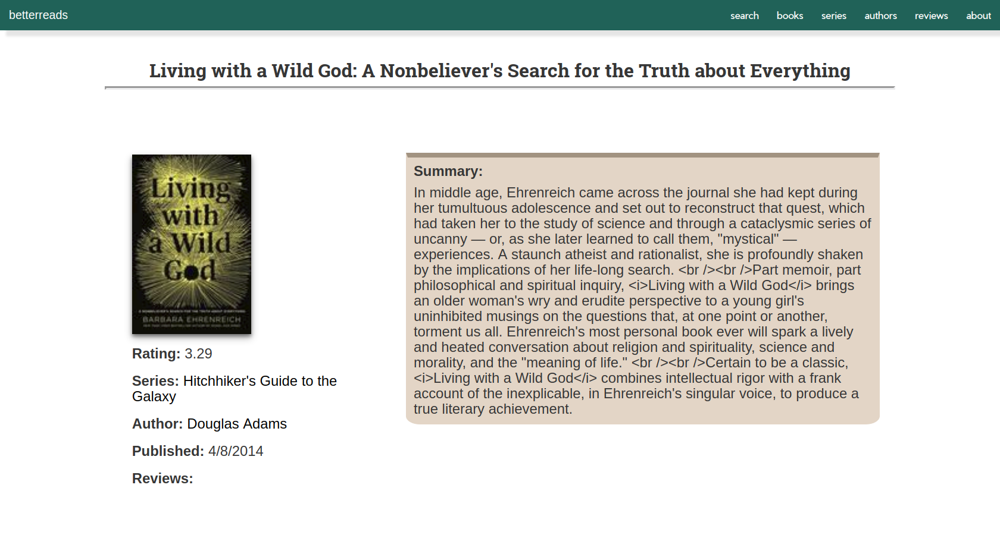
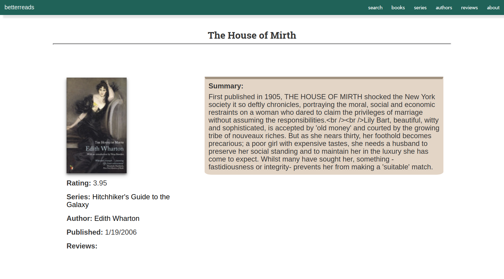
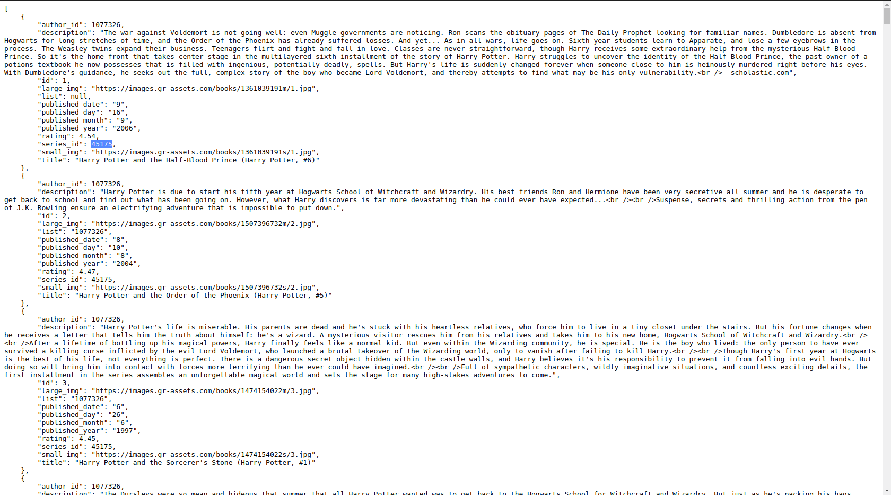
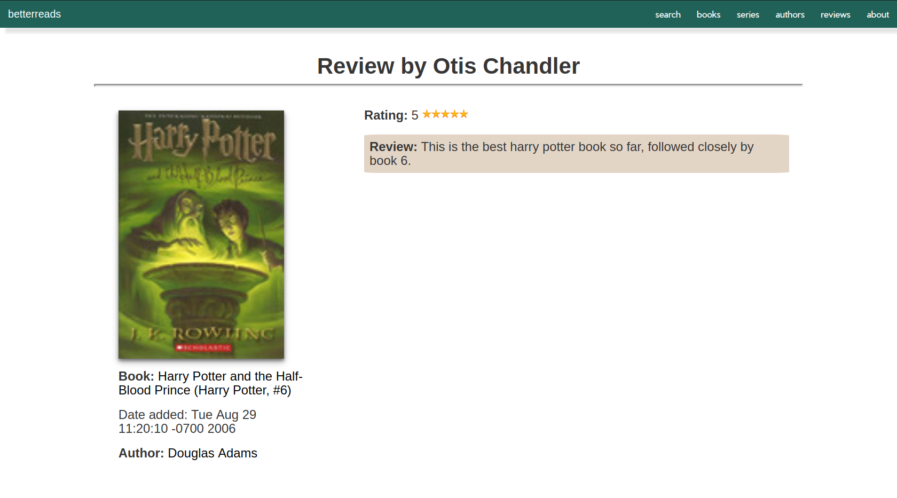
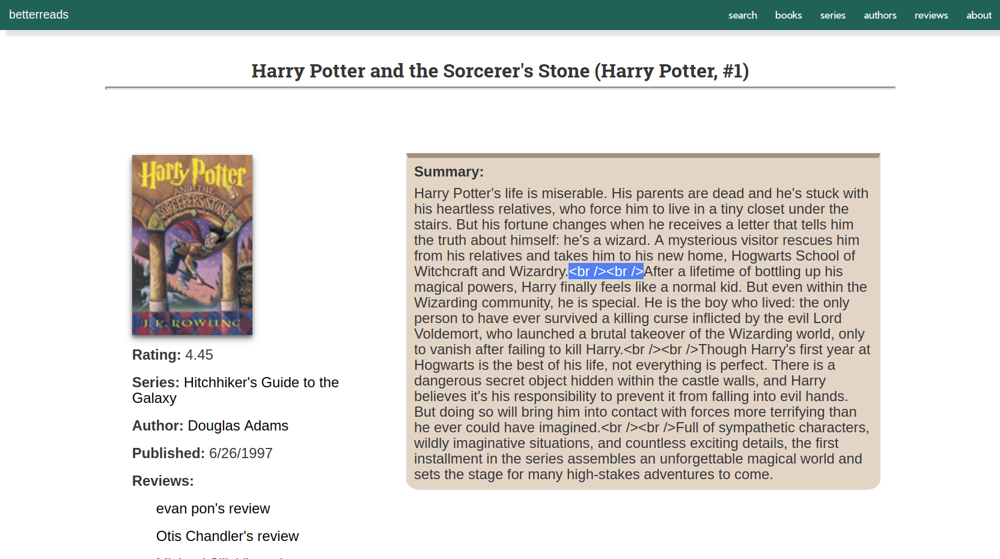
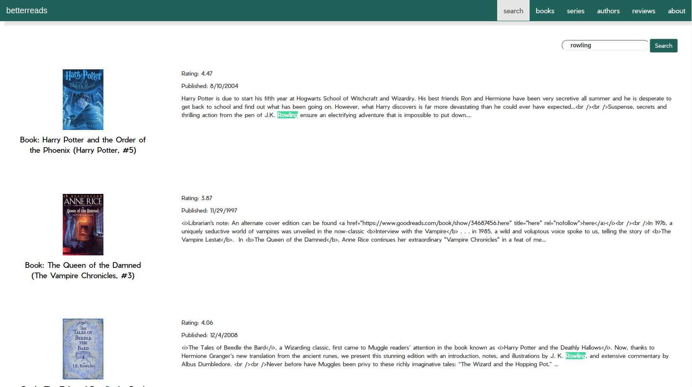
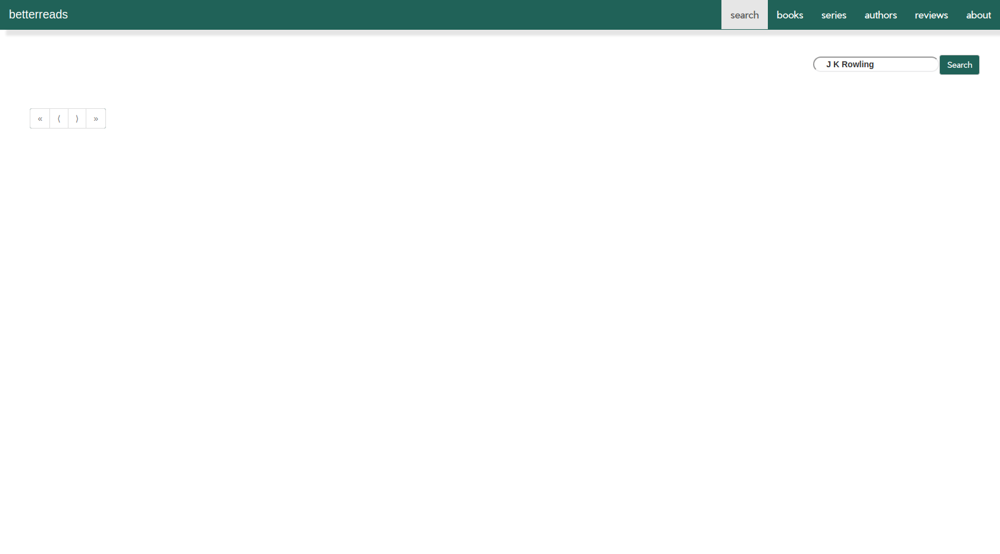

@title[Title]
###  Overwatchglamour.me
Group 4

---
@title[Introduction]
###  Introduction

---
@title[Demonstration]
###  Demonstration

 
<a target="_blank" href="https://overwatchglamour.me" style="color:white">Navigate</a>

<a target="_blank" href="https://overwatchglamour.me/search%3Fsearch_str%3Dthe%3Fcurrent_view%3DHero" style="color:white">Search</a>

<a target="_blank" href="https://overwatchglamour.me" style="color:white">Unit Tests</a>
 
---
@title[Self Critique]
###  Self Critique
#### <a target="_blank" href="https://overwatchglamour.me" style="color:white">overwatchglamour.me</a>

+++

*Instance pages could have been more user friendly.*

Solution: Overlay data on the image instead of having to scroll past the image.

+++

*Finding things relating to a specific Hero could be easier. Currently filters by whether it is associated with a hero or not.*

Solution: Add a drop down menu filter by a specific hero option to items, skins, and achievements models.

+++

*Search bar could be centered or more aesthetically placed.*

Solution: Nest the search bar into the nav bar.

+++

*Rectangular skin images are slightly warped in square image boxes.*

Solution: Pre-crop the centered images of skins into squares, or define the image property to cover instead of contain.

+++

*Chrome sometimes adds "www." to the url, while Mozilla does not, resulting in a dead end.*

Solution: Make both forms of the url direct to the website.

---
@title[Other Critique]
###  Other Critique
#### <a target="_blank" href="https://betterreads.me" style="color:white">betterreads.me</a>

+++
@title[Wrong Author Wrong Series]
###  Wrong Author Wrong Series

+++
@title[Right Author Wrong Series]
###  Right Author Wrong Series

+++
@title[API has right Series]
###  API returns correct series ID

+++
@title[Mismatched Reviews]
###  Mismatched Reviews

+++
@title[Broken HTML in text]
###  Broken HTML in text

+++
@title[HTML in search results]
###  HTML in search results

+++
@title[Exact Search]
###  Exact Search

---
@title[Visualization]
###  Visualization

