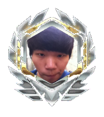
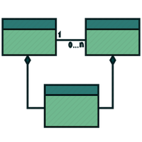
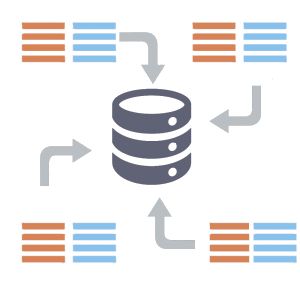

@title[Title]
###  Overwatchglamour.me
Group 4

---
@title[Introduction]
###  Introduction

+++
@title[Akhil]

+++
@title[Allen]

+++
@title[Peter]

+++
@title[Sangwon]

---
@title[Demonstration]
###  Demonstration

 
<a target="_blank" href="https://overwatchglamour.me" style="color:white">Navigate</a>

<a target="_blank" href="https://overwatchglamour.me/search%3Fsearch_str%3Dthe%3Fcurrent_view%3DHero" style="color:white">Search</a>

<a style="color:white">Unit Tests</a>
 
---
@title[Self Critique]
###  Self Critique
#### <a target="_blank" href="https://overwatchglamour.me" style="color:white">overwatchglamour.me</a>

+++
@title[Instance Pages]
*Instance pages could have been more user friendly.*

Solution: Overlay data on the image instead of having to scroll past the image.

+++
@title[Hero Specific Filter]
*Finding things relating to a specific Hero could be easier. Currently filters by whether it is associated with a hero or not.*

Solution: Add a drop down menu filter by a specific hero option to items, skins, and achievements models.

+++
@title[Search bar UI]
*Search bar could be centered or more aesthetically placed.*

Solution: Nest the search bar into the nav bar.

+++
@title[Warped Skins]
*Rectangular skin images are slightly warped in square image boxes.*

Solution: Pre-crop the centered images of skins into squares, or define the image property to cover instead of contain.

---
@title[Other Critique]
###  Other Critique
#### <a target="_blank" href="https://betterreads.me" style="color:white">betterreads.me</a>

+++
@title[Missing Author and or Series]
###  Database connection issues
Some books will have "No Series" and/or "No Author when not appropriate".

+++
@title[Review of a book lists incorrect author]
###  Right Author Wrong Series
Some reviews have the incorrect book being reviewed, but also the incorrect author of the incorrect book displayed. (Otis Chandler on Harry Potter #6)

+++
@title[Exact Search]
###  Exact Search
The search finds exact matches by not omitting periods from the search. (J.K. Rowling)

+++
@title[Unclear/Incorrect Filters]
###  Filters unclear or wrong
When filtering by "Top Rated Books", the criteria seems to be to filter out books with ratings lower than 4.2. 
The other two filters, "Series" and "Most Recent", are not actual filters, since they seem to still include books that are not in a series or just sort by how recent instead of filtering.

+++
@title[Filter and Sorting is disjoint]
###  Disjoint Filter and Sort
It is not possible to sort and filter at the same time. Choosing one, overrides the other.

---
@title[Visualization]
###  Visualization

<a target="_blank" href="http://overwatchglamour.me/visualization" style="color:white">Link</a>
