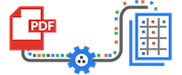

@title[Title]
###  Overwatchglamour.me
Group 4

---
@title[Introduction]
###  Introduction

+++
@title[Akhil]

+++
@title[Allen]

+++
@title[Peter]

+++
@title[Sangwon]

---
@title[Demonstration]
###  Demonstration

 
<a target="_blank" href="https://overwatchglamour.me" style="color:white">Navigate</a>

<a target="_blank" href="https://overwatchglamour.me/search%3Fsearch_str%3Dthe%3Fcurrent_view%3DHero" style="color:white">Search</a>

<a style="color:white">Unit Tests</a>
 
---
@title[Self Critique]
###  Self Critique
#### <a target="_blank" href="https://overwatchglamour.me" style="color:white">overwatchglamour.me</a>

+++
@title[What did we do well?]
###  What did we do well?

- Asset Collection and Database Population
 - No Official API or asset sources
 - Multiple APIs and scrapers to gather, combine, reformat, and organize
- Team Cohesion and Organization
- Models are well connected

+++
@title[What did we learn?]
###  What did we learn?

- Overwatch
- Being resourceful and adaptive to scrape for resources
- Task and issue tracking with Trello
- Github version control
- GCP is expensive

+++
@title[What can we do better?]
###  What can we do better?

+++
@title[Instance Pages]
*Instance pages could have been more user friendly.*

Solution: Overlay data on the image instead of having to scroll past the image.

+++
@title[Hero Specific Filter]
*Finding things relating to a specific Hero could be easier for Achievements. Currently, hero-specific filters exist for all other models, but Achievements can only filter for hero association or no hero association*

Solution: Add the same drop down menu filter in the other models to Achievements, but include the existing options in the drop down menu as well.

+++
@title[Search bar UI]
*Search bar could be centered or more aesthetically placed.  Search algorithm could be improved.*

Solution: Nest the search bar into the nav bar.

+++
@title[Placeholder image]
*Website is slow*

Solution: Add caching to the website.

+++
@title[What puzzles us?]
###  What puzzles us?

- Database connection
- React

---
@title[Other Critique]
###  Other Critique
#### <a target="_blank" href="https://betterreads.me" style="color:white">betterreads.me</a>

+++
@title[What did they do well?]
###  What did they do well?

- Aesthetic landing page and about page
- Nav bar highlights, 
- Page loads quickly and all at once
- They have a cool loading icon
- They implemented a search for each model

+++
@title[What did we learn from their website?]
###  What can we learn from their website?

- The layout of the website could be much more interactive without sacrificing clarity and minimalism.
- J.K. Rowling has written other books apperently?

+++
@title[What can they do better?]
###  What can they do better?

+++
@title[Missing Author and or Series]
###  Database connection issues
Some books will have "No Series" and/or "No Author when not appropriate".

+++
@title[Review of a book lists incorrect author]
###  Reviews wrong book with wrong author
Some reviews have the incorrect book being reviewed, but also the incorrect author of the incorrect book displayed. (Otis Chandler on Harry Potter #6; Author is Dale Peck)

+++
@title[Exact Search]
###  Exact Search
The search finds exact matches by not omitting periods from the search. (J.K. Rowling)

+++
@title[Unclear/Inaccurate Filter Conditions]
###  Filters unclear or wrong
When filtering by "Top Rated-",e.g. "Top Rated Books" , the criteria seems to be to filter out books with ratings lower than 4.2. 

The other two filters, "Series" and "Most Recent", are not actual filters, since they seem to still include books that are not in a series or just sort by how recent instead of filtering.

+++
@title[Filter and Sorting is disjoint]
###  Disjoint Filter and Sort
It is not possible to sort and filter at the same time. Choosing one, overrides the other.

+++
@title[Book information on Reviews page]
###  Images in Reviews
While the reviews tab has information on ratings, the reviewer's name, and date, it does not give information on the book being reviewed which would be very ueful for a user to know.

+++
@title[What puzzles us about their website?]
###  What puzzles us about their website?

- The landing page carousel displays books can not be clicked.
- Why not have the first book's cover be the image for the Series Model instead of all placeholder images?
- Why their website has weird mistakes in their data, even though their API seems to have accurate data?

---
@title[Visualization]
###  Visualization

<a target="_blank" href="http://overwatchglamour.me/visualization" style="color:white">Link</a>
